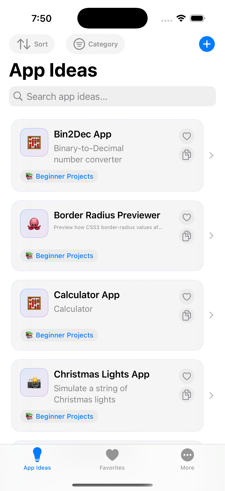
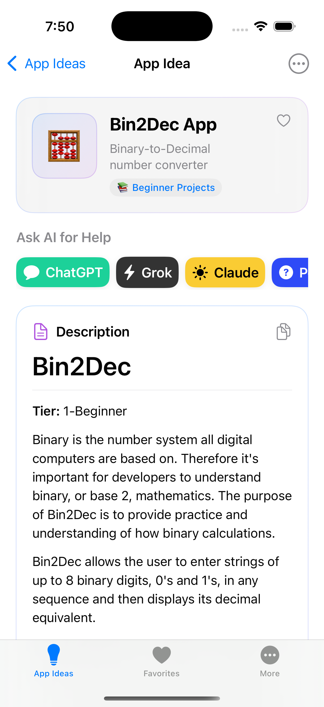
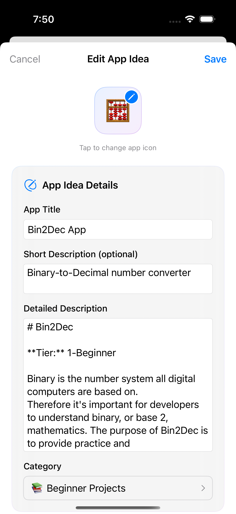

# App Ideas 💡

A Swift iOS app for discovering, managing, and organizing app development project ideas. This app provides a curated collection of app ideas organized by difficulty levels (Beginner, Intermediate, Advanced), helping developers find inspiration for their next project. Each idea includes detailed requirements, user stories, constraints, and useful resources.

> **Inspired by [florinpop17/app-ideas](https://github.com/florinpop17/app-ideas)** - A massive collection of application ideas for improving coding skills with 84.6k+ stars! 🌟

## 📸 Screenshots

<p align="center">
  
  
  
</p>

## ✨ Features

- 📚 **Curated App Ideas**: Browse a comprehensive collection of app development project ideas organized by difficulty levels.
- 🏷️ **Categories**: Organize and filter app ideas by categories for easier discovery.
- ❤️ **Favorites**: Mark your favorite app ideas for quick access and future reference.
- 📝 **Detailed Information**: Each app idea includes detailed requirements, user stories, constraints, and useful resources.
- 🖥️ **Modern SwiftUI Interface**: Clean, tab-based navigation with intuitive design.
- 🧩 **Modular Architecture**: Includes a reusable `MoreApps` module for app recommendations, with localization support.
- 💾 **Local Data Management**: Uses GRDB for efficient, local data storage and management.
- 🌙 **Dark Mode**: Supports system-wide dark mode, with user preference override.
- 📢 **Ad Integration**: Integrates Google Mobile Ads with ATT permission handling.
- 🛒 **App Store Links**: The More tab features other recommended apps with direct App Store links.
- 🚀 **Perfect for Learning**: Great for improving coding skills, experimenting with new technologies, and building your portfolio!

## 🚀 Getting Started

### Prerequisites

- Xcode 14 or later
- Swift 5.7+
- iOS 17.0+

### Installation

1. Clone the repository:
   ```bash
   git clone https://github.com/banghuazhao/app-ideas.git
   cd app-ideas
   ```
2. Open `AppIdeas.xcodeproj` in Xcode.
3. Run the project on your simulator or device.

### 🗂️ Project Structure

- `AppIdeas/App/` – App entry point and main views (tab navigation)
- `AppIdeas/Components/` – SwiftUI components (AppIdeas, Favorites, More, etc.)
- `AppIdeas/Model/` – Data models (`AppIdea`, `Category`)
- `AppIdeas/Service/` – Data management, ad services, and app services
- `AppIdeas/Modules/MoreApps/` – Modular feature for app recommendations (with localization)
- `AppIdeas/Doc/` – Markdown files containing app idea documentation organized by difficulty
- `AppIdeas/Assets.xcassets/` – App icons and assets

## 📝 Data Model Example

```swift
struct AppIdea: Identifiable, Hashable {
    let id: Int
    var title: String = ""
    var icon: String = "💻"
    var shortDescription: String = ""
    var detail: String = ""
    var isFavorite: Bool = false
    var updatedAt: Date = Date()
    var categoryID: Category.ID? = nil
}
```

## 📚 App Ideas Collection

The app includes a comprehensive collection of app development project ideas from the original [florinpop17/app-ideas](https://github.com/florinpop17/app-ideas) repository:

### 🟢 Beginner Level
- Hello App - Geolocation-based greeting app
- Calculator App - Basic calculator functionality
- Weather App - Weather information display
- Stopwatch App - Timer and stopwatch functionality
- Quiz App - Interactive quiz application
- And many more...

### 🟡 Intermediate Level
- To-Do App - Task management application
- Currency Converter - Real-time currency conversion
- Drawing App - Canvas-based drawing tool
- FlashCards App - Educational flashcard system
- And many more...

### 🔴 Advanced Level
- Chat App - Real-time messaging application
- Movie App - Movie database and recommendations
- Instagram Clone - Social media photo sharing
- Elevator App - Complex state management simulation
- And many more...

> 💡 **Perfect for developers at any level** - Whether you're just starting out or looking to challenge yourself with complex projects!

## 🤝 Contributing

Contributions are welcome! Please open issues or pull requests for new app ideas, features, or bug fixes. To add new app ideas, simply add new markdown files to the appropriate difficulty folder in `AppIdeas/Doc/`.

## 📄 License

[MIT](LICENSE)

## 👤 Author

- [banghuazhao](https://github.com/banghuazhao)

## 💡 Purpose

This app serves as a comprehensive resource for developers looking for project ideas to build their portfolio, learn new technologies, or practice their skills. Each app idea includes detailed specifications, user stories, and implementation guidance to help developers get started quickly.

## ⭐ Show Your Support

If this project helped you in any way, please consider:

- ⭐ **Star this repository** - It helps others discover this project
- 👤 **Follow me on GitHub** - [@banghuazhao](https://github.com/banghuazhao) for more awesome projects
- 🚀 **Share with friends** - Help spread the word about this learning resource

> **Why star this project?** 🌟
> - Help other developers discover this learning resource
> - Support open-source development
> - Get notified of updates and new features
> - Show appreciation for the work put into this project

---

**Built with ❤️ by [banghuazhao](https://github.com/banghuazhao)** 